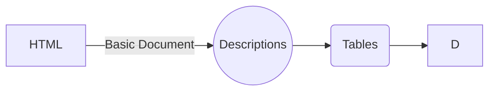

# Welcome!

Hi, this is **Hayden Cahoon**, and I love to code, so I am going to teach anyone who wants to know how to code. Today we are going to learn my favorite language **HTML**. 
😆

```mermaid
graph LR
A[HTML] -- Basic Document --> B((Descriptions))
B --> C(Tables)
C --> D
```
